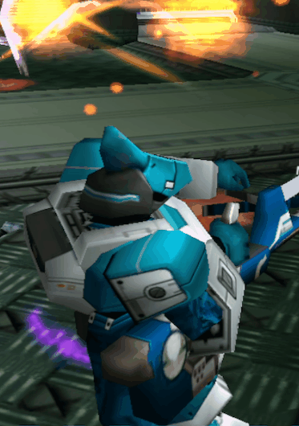

## PSOBB DropBox Tracker Addon

DropBox Tracker is incredibly useful at showing exactly what an item drop contains and where it is so, you can efficiently run over and grab drops you care about without having to run over each and every drop.

_Some psobb clients may also have minimap dots for rare drops and even allow you to customize which drops show up (see mapitem.txt on Ephinea). This adds on top of that with a much more intuitive overlay on important drops!_

----
_Note: for Phantasy Star Online: Blue Burst_

### REQUIRED Pre-Requisite
 *Ignore if you already have the psobb addons working*
 * #### [PSOBB Base Addon](https://github.com/Solybum/psobbaddonplugin?tab=readme-ov-file#installation)

### Installation
* Recommended Process: [Semi-Automatic Updating](./docs/Semi-Automatic_Updating.md)
 
 OR

* Quick Install:
    1. Download as a .zip file from Github.
        * Extract .zip

    2. Place "DropBox Tracker" folder inside the "addons" folder, which is same folder where all the other psobb addons are.
        * Note: all files; *init.lua*, *configuration.lua* must be inside "DropBox Tracker"
        * *options.lua* file should be created if you make a settings change to store them.

### Configuration
This is straight-forward if you're at all used to other psobb lua addons utilizing imgui.
- Load up the game, and join or create a party to, and enter into an easy combat zone where you're not likely to die.
- Press ` (*backtick char*) to open addon menu, if it isn't already.
    - This is typically the same key as ~ (*tilde key*) on the keyboard, directly below esc (escape key).
- Click "DropBox Tracker" on the Main Menu to bring up the configuration menu.
- Double click the "DropBox Tracker - Configuration" window to expand it fully, if it isn't already.
- You'll now see all the various options and can adjust the tracker size, position, and color and thickness you'd like each type of drop to have.

### Demo
_Click each Image to Watch_

 

